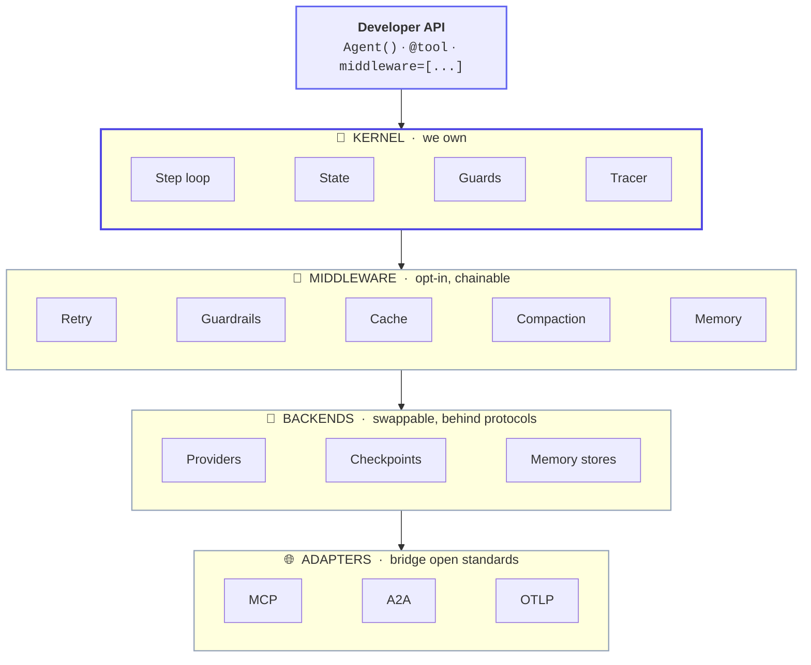

# Architecture

## Design principles

These are binding constraints, not aspirations.

1. **Tiny kernel.** The core is the execution loop, the state model, and the
   guard checks — importable with zero third-party runtime dependencies beyond
   the standard library + Pydantic + anyio.
2. **Everything is a plugin.** Each feature is exactly one of: **middleware**
   (wraps a step), **backend** (implements a protocol), or **adapter** (bridges a
   standard). If a feature requires editing the kernel, it was modeled wrong.
3. **Pay only for what you import.** A beginner imports nothing extra and writes
   3 lines. An enterprise stacks a dozen middlewares. Same kernel.
4. **Protocol-first.** Consume MCP and A2A rather than inventing proprietary
   equivalents. Lock-in is a non-goal.
5. **Observable & deterministic by default.** Every step emits a trace event and
   an OpenTelemetry span. No hidden state, no hidden prompts.
6. **Async-first.** The core is `async`; a thin synchronous facade sits on top.
7. **Typed and validated.** Pydantic v2 at every boundary.

## The four planes



The kernel never *constructs* behavior; it *invokes hooks*. Middlewares attach to
defined hook points; backends sit behind tiny protocols; adapters translate open
standards.

## Repository layout

```
spine/
├── packages/
│   ├── spine-core/         # kernel, protocols, guards, tracer
│   ├── spine-cli/          # Typer CLI + templates + dev server
│   ├── spine-providers/    # OpenAI, Anthropic adapters
│   ├── spine-middleware/   # the middleware suite
│   ├── spine-backends/     # sqlite/redis/postgres + vector/buffer/pgvector
│   ├── spine-mcp/          # MCP client adapter
│   ├── spine-a2a/          # A2A adapter
│   ├── spine-otel/         # OpenTelemetry middleware
│   ├── spine-eval/         # eval harness + scorers
│   └── spine-orchestration/# sequential / supervisor / handoff
└── docs/
```

The source is organized by plane under `packages/*/src/` (import names
`spine_core`, `spine_providers`, …), but it all ships as **one distribution,
`spinekit`** — a lean core (Pydantic + anyio) with heavy dependencies as opt-in
extras (`spinekit[openai]`, `spinekit[redis]`, `spinekit[all]`, …). The code is
small; only the third-party dependencies are optional.

## The bet

The integration layer that made monolithic frameworks valuable has been
commoditized by open standards. The durable value sits in the **reliability
runtime** — the execution loop, guards, durable state, and observability that
decide whether an agent survives production. Spine owns that core and lets the
standards do the integration.
