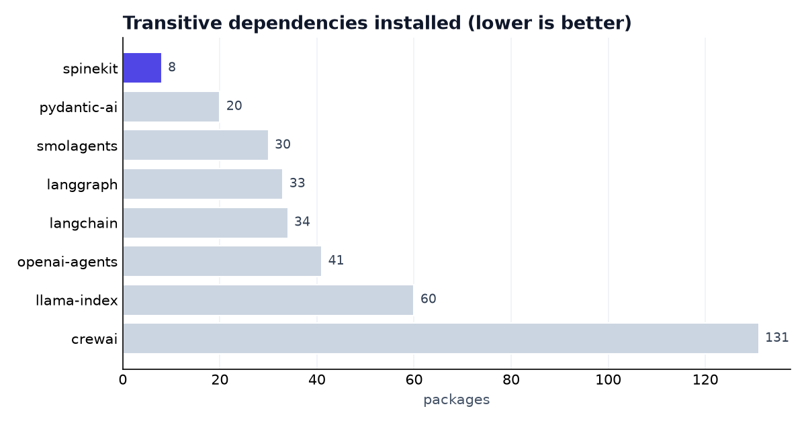
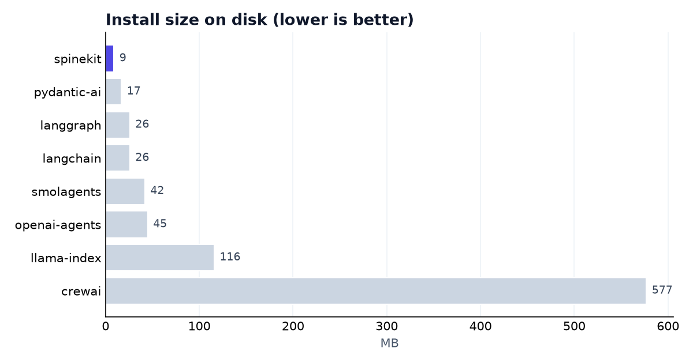

# Benchmark

How Spine (`spinekit`) compares to other Python agent frameworks on **objective,
reproducible** metrics. No hand-waving: every number here was measured with the
script in [`scripts/benchmark.sh`](https://github.com/Research-Analytics-Solutions/spine/blob/main/scripts/benchmark.sh),
and you can re-run it yourself.

!!! info "What this is — and isn't"
    This measures **footprint** (dependencies, install size) and **code to
    accomplish a task** — the things that affect *your* project's weight and
    ergonomics. It does **not** measure model quality or end-to-end latency:
    those are dominated by the LLM, not the framework, and aren't a fair
    framework comparison.

## Methodology

- **Date:** 2026-06-19 · **OS:** macOS (arm64) · **Python:** 3.13 · installer: `uv`.
- Each framework installed **fresh in its own empty virtualenv** with its base
  package (no extras), then measured for transitive dependency count and
  on-disk size of `site-packages`.
- Versions pinned to whatever was current that day (listed below).
- Reproduce: `bash scripts/benchmark.sh`.

## Footprint — dependencies & install size

The base install is what every user of your project pays for. Spine's kernel
depends on only **Pydantic + anyio**.

{ loading=lazy }

{ loading=lazy }

| Framework | Version | Packages | Install size |
|---|---:|---:|---:|
| **spinekit** | 0.2.0 | **8** | **9 MB** |
| pydantic-ai (slim) | 1.107.0 | 20 | 17 MB |
| smolagents | 1.26.0 | 30 | 42 MB |
| langgraph | 1.2.6 | 33 | 26 MB |
| langchain | 1.3.10 | 34 | 26 MB |
| openai-agents | 0.17.5 | 41 | 45 MB |
| llama-index-core | 0.14.22 | 60 | 116 MB |
| crewai | 1.14.7 | 131 | 577 MB |

**spinekit installs the fewest packages and the smallest footprint of the set** —
~2.5× fewer deps than the next lightest, and ~16–65× smaller than the heaviest.
Heavy provider/vector/telemetry deps are opt-in extras (`spinekit[openai]`, …),
so they only land in your project when you ask for them.

## Lines of code to a working tool-using agent

Spine's minimal "agent that can call a tool" — **executed**, this is the whole
program:

```python
from spine_core import Agent, tool

@tool
async def add(a: int, b: int) -> int:
    """Add two numbers."""
    return a + b

agent = Agent("openai:gpt-4o-mini", tools=[add])
print((await agent.run("add 2 and 2")).answer)
```

**6 source lines** (excluding the docstring). The same three lines get you a bare
agent:

```python
from spine_core import Agent
agent = Agent("openai:gpt-4o-mini")
print((await agent.run("hello")).answer)
```

!!! note "On cross-framework LOC"
    A minimal tool-agent in `pydantic-ai` / `smolagents` is similarly small;
    `langchain`, `langgraph`, and `crewai` typically need more wiring (graph
    nodes, crews/tasks, or executor setup). Exact counts depend on the API
    surface you use, so we publish **Spine's verified numbers** and leave precise
    cross-framework counts to the linked, runnable examples rather than asserting
    figures we didn't execute.

## What ships in the box (no extra install)

The kernel does more in its small footprint than most frameworks do at all:

| Capability | spinekit | Notes |
|---|---|---|
| Guards (steps/cost/tokens/time) enforced **in the kernel** | ✅ built-in | structural, every step |
| No hidden prompts (typed `Message` everywhere) | ✅ | |
| Durable HITL interrupt/resume across restart | ✅ built-in | |
| Deterministic record/replay | ✅ middleware | |
| Streaming (tokens + step events) | ✅ | |
| Checkpoint backends (SQLite/Redis/Postgres) | ✅ | extras for redis/postgres |
| Semantic memory (pluggable embedders) | ✅ | |
| MCP tools · A2A agents · OpenTelemetry | ✅ adapters | |
| Eval harness (Cost/Latency/Efficacy/Reliability) | ✅ | |
| Multi-agent (sequential/supervisor/handoff) | ✅ | |
| `mypy --strict` clean, typed at every boundary | ✅ | |

(Feature availability in other frameworks varies by version and add-ons — verify
against their docs; this column states only what Spine ships.)

## Spine internals

Measured on this repo:

- **Kernel loop** (`agent.py`): **540 lines**.
- **`spine_core` total**: ~1,700 lines, **2 runtime dependencies**.
- **135 tests**, all of ruff + `mypy --strict` clean in CI.

## Caveats

- Footprint depends on the platform and resolver date; re-run the script for your
  environment.
- "Base install" excludes extras; a fair head-to-head adds the provider SDK both
  sides need (e.g. `spinekit[openai]` ≈ +1 dependency: `openai`).
- We deliberately omit import-time and runtime-latency numbers: modern frameworks
  lazy-load top-level imports (making import time non-comparable), and latency is
  the model's, not the framework's.
