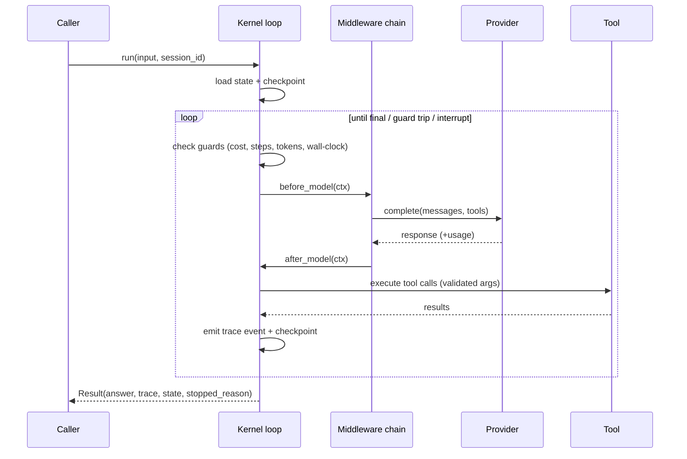

# The kernel

The kernel is the load-bearing loop everything plugs into. It never *constructs*
behavior — it loads state, checks guards, invokes middleware hooks, calls the
provider, runs validated tools, emits a trace event per transition, and
checkpoints.

## One `run()`



## Hook points

A middleware implements any subset of these; the kernel calls only what's defined:

| Hook | When |
|---|---|
| `on_run_start(state)` | once, as a run begins |
| `before_model(ctx)` | before each model call — may preset `ctx.response` to short-circuit |
| `after_model(ctx)` | after the response, **before** usage is banked |
| `before_tool(ctx)` / `after_tool(ctx)` | around each tool call |
| `on_error(ctx, err)` | provider failed — return `retry` / `fallback` / `skip` / `fail` |
| `on_run_end(state, result)` | once, as a run ends |

## Structured stop reasons

A run never just "ends" — it stops for an enumerable reason you can branch on:

`final` · `max_steps` · `max_cost` · `max_tokens` · `timeout` · `max_depth` ·
`loop` · `guardrail` · `interrupt` · `error` · `cancelled`

```python
result = await agent.run("…")
if result.stopped_reason.value == "interrupt":
    ...  # human-in-the-loop: resume later
```

## Capabilities built in

- **Parallel tool calls** — `Agent(..., parallel_tools=True)` fans a batch out
  concurrently, preserving call order in the results.
- **Cooperative cancellation** — `run(..., should_cancel=fn)` stops cleanly at a
  step boundary with state checkpointed (resumable).
- **Sub-agents** — `agent.as_tool()` exposes an agent as a tool another agent can
  call, with delegation-depth cycle bounding.

See [State & checkpoints](state.md) and [Human-in-the-loop](hitl.md) for how runs
survive restarts.
